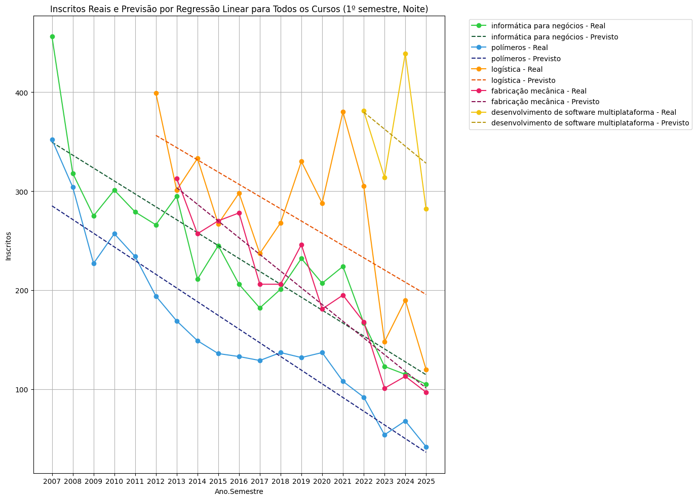
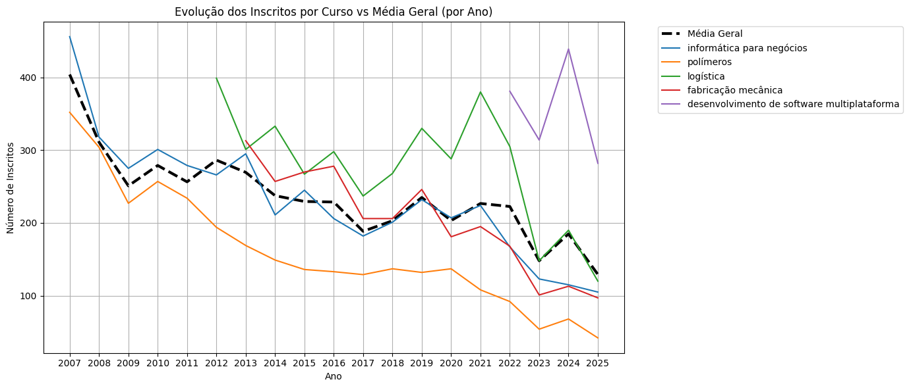
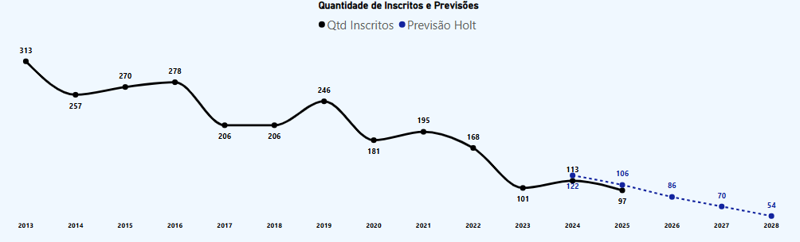
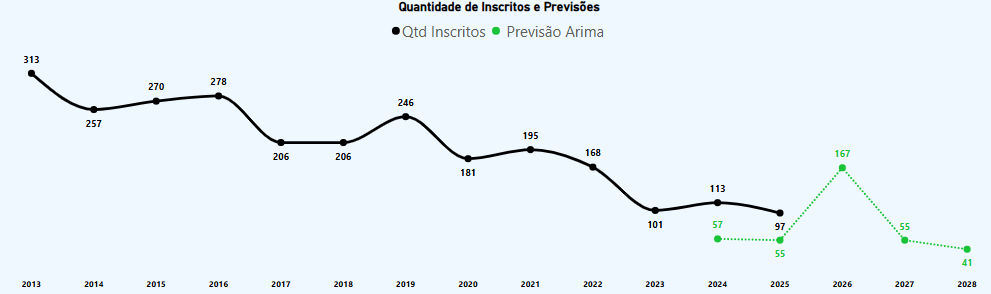
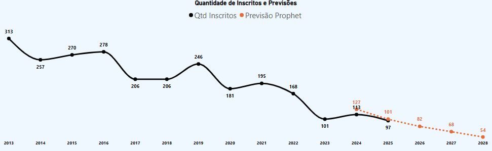
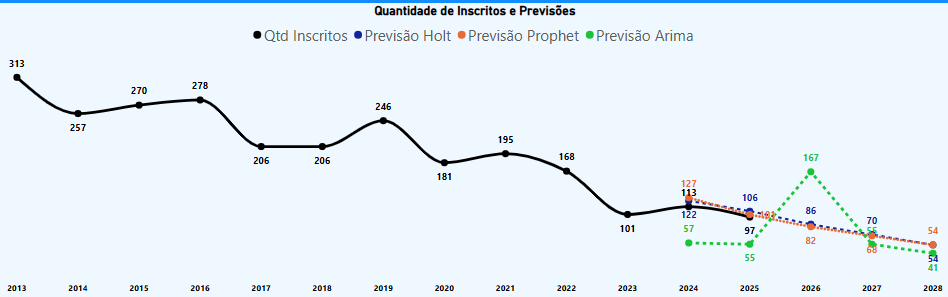
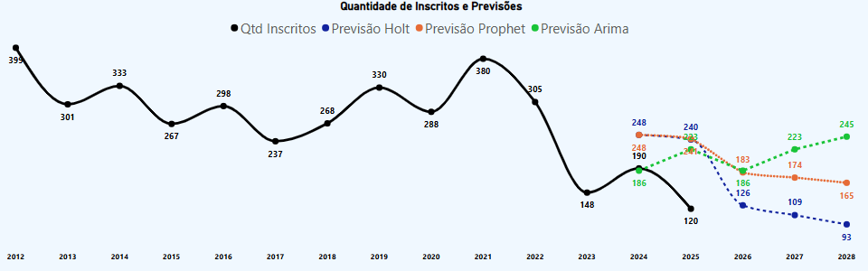
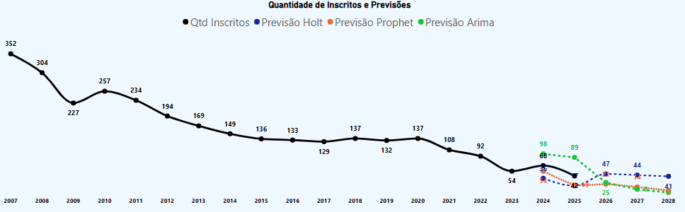
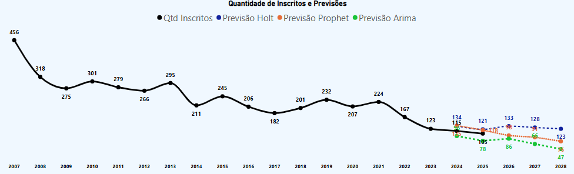
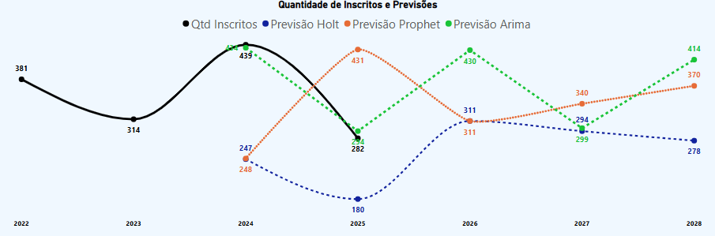

# Previsão de Demandas da FATEC de Mauá com Machine Learning

Este projeto tem como objetivo analisar e prever a quantidade de inscritos nos vestibulares da FATEC Mauá ao longo dos anos, utilizando modelos de séries temporais e algoritmos de aprendizagem de máquina como ARIMA, Prophet e Holt-Winters.

A coleta de dados foi automatizada com uma aplicação em C# via Web Scraping e os modelos foram implementados em Python por meio de notebooks interativos.

## Autores

- Adriano das Chagas Barros  
- Brendon Gomes da Silva  
- Elias Sousa Barbosa  
- Rafael Ricardo Gonçalves

---

## **Descrição do Projeto**

🔗 [Link da apresentação exportada do PowerBI](./Apresentação%20PowerBI.pdf)

A proposta desta pesquisa é desenvolver modelos de previsão baseados em dados históricos de inscrições da FATEC Mauá, utilizando técnicas estatísticas e algoritmos de Machine Learning.

A aplicação prática desses modelos visa apoiar a tomada de decisões e a análise de tendências para os próximos vestibulares da Faculdade de Tecnologia de Mauá.

### **Coleta de Dados**

A extração dos dados foi realizada com um software de automação desenvolvido em **C# .NET Framework** utilizando **Selenium** para Web Scraping. A aplicação acessa o site oficial e extrai informações sobre as demandas de todos os cursos desde 2007 até 2025, salvando-as em arquivos CSV.

- 🔗 [Repositório da aplicação de Web Scraping (C#)](https://github.com/Brendon3578/FatecDemandaDownloaderNetFramework)
- 📼 [Vídeo do software de Web Scraping funcionando](./videos/web_scraping.mp4)
- 📁 [Arquivo CSV de demandas exportado](./data_source/fatec_demanda_data.csv)

---

## **Tratamento de Dados**

Para a utilização dos dados para a análise, foi feito uma trativa e normalização dos dados, para se obter uma interpretação mais precisa.

- Padronização de nomes de cursos e períodos, como: Diurno (Manhã e Tarde), Noturno e EAD.
- Normalização de semestres.
- Organização temporal dos dados (1º e 2º semestres).
- Processamento realizado tanto no **Notebook Python** quanto na planilha de **Excel**.

---

## **Modelos de Previsão Utilizados**

### 🔹 **Regressão Linear**

> A regressão linear é uma técnica de análise de dados que prevê o valor de dados desconhecidos usando outro valor de dados relacionado e conhecido.

🔗 [Link da previsão com Regressão Linear](./notebook/Análise_de_Demandas_da_Fatec_de_Mauá_(1_3)_Analise_de_Pearson.ipynb)

- Foi utilizada como modelo base por sua simplicidade e fácil interpretação.
- Ela é ideal para identificar tendências lineares ao longo do tempo, como o crescimento ou queda no número de inscritos.
- Útil em cursos ou períodos com comportamento estável e sem sazonalidade marcante.
- Serviu como modelo de comparação (baseline) para validar a eficácia de algoritmos mais complexos como ARIMA ou Prophet.

Ela é ideal para identificar tendências lineares ao longo do tempo e é fácil de interpretar. Apesar de simples, serve como comparação para validar a eficácia de modelos mais complexos.

#### Inscritos Reais e Previsão por Regressão Linear para Todos os Cursos (1º semestre, Noite)

- Para cada curso, foi ajustada uma regressão linear simples (ano x inscritos).
- Coeficiente de determinação R²: Mede o quão bem o modelo se ajusta aos dados. Quanto mais próximo de 1, melhor o ajuste.
- Coeficiente Angular: Indica a variação média de inscritos por ano. Valor negativo = tendência de queda.
- Coeficiente Linear: Valor inicial estimado da reta. Serve como referência, mas tem pouca interpretação prática direta.

| Curso                                       | R²     | Coef. Angular  | Coef. Linear  |
|---------------------------------------------|--------|----------------|---------------|
| Polímeros                                   | 0.8827 | -13.82         | 28027.52      |
| Logística                                   | 0.4136 | -12.36         | 25216.67      |
| Informática para Negócios                   | 0.7890 | -13.04         | 26524.88      |
| Fabricação Mecânica                         | 0.8846 | -16.86         | 34248.05      |
| Desenvolvimento de Software Multiplataforma | 0.1004 | -17.20         | 35158.20      |

#### Evolução dos Inscritos por Curso vs Média Geral (por Ano)

### 🔹 **Holt-Winters**

> Modelo que utiliza suavização exponencial com três componentes: nível, tendência e sazonalidade.

🔗 [Link da previsão com algoritmo Holt Winters](./notebook/Vestibular_Graficos_Projeção.xlsx)

- Leva em conta o nível, tendência e sazonalidade dos dados.
- Recomendado para séries temporais com comportamento sazonal regular.
- Possui desempenho limitado em séries com variações bruscas.

#### Projeção com Holt Winters da quantidade de Inscritos (Curso de Fabricação Mecânica, 1º Semestre, Noite)

### 🔹 **ARIMA (AutoRegressive Integrated Moving Average)**

> É um algoritmo de estatísticas comumente usado para previsão de série temporais. O algoritmo é especialmente útil para conjuntos de dados simples com menos de 100 séries temporais.

🔗 [Link da previsão com algoritmo ARIMA](./notebook/Análise_de_Demandas_da_Fatec_de_Mauá_(2_3)_Projeção_Arima.ipynb)

- Modelo que combina componentes autoregressivos, diferenciação para remover tendências e média móvel.
- Baseado em três componentes:
  - AR (Autoregressivo)
  - I (Integração - diferenciação dos dados)
  - MA (Média móvel dos resíduos)
- Indicado para dados com tendência e pouca sazonalidade.
- Pode apresentar bom desempenho quando bem parametrizado, mesmo com séries curtas.
- Requer definição precisa dos parâmetros.

#### Projeção com ARIMA da quantidade de Inscritos (Curso de Fabricação Mecânica, 1º Semestre, Noite)

### 🔹 **Prophet**

> É um algoritmo de previsão de séries temporais baseado em um modelo aditivo em que as tendências não lineares se ajustam à sazonalidade anual, semanal e diária. Funciona melhor com séries temporais que tenham fortes efeitos sazonais e várias temporadas de dados históricos.

🔗 [Link da previsão com algoritmo PROPHET (1 Semestre)](./notebook/1sem_Prophet.ipynb)

🔗 [Link da previsão com algoritmo PROPHET (2 Semestre)](./notebook/2sem_Prophet.ipynb)

- Modelo de fácil aplicação desenvolvido pelo Facebook. Ideal para séries com tendência, sazonalidade e eventos especiais.
- Modelo aditivo com componentes de tendência, sazonalidade e feriados.
- Robusto a dados ausentes e mudanças repentinas nos padrões.
- Ajusta automaticamente os parâmetros e lida bem com sazonalidade.
- Automatiza o ajuste de parâmetros e fornece boas previsões mesmo em séries incompletas.

#### Projeção com PROPHET da quantidade de Inscritos (Curso de Fabricação Mecânica, 1º Semestre, Noite)

---

## Projeção com os 3 Modelos

Comparativo entre as projeções feitas com o ARIMA, Prophet e o Holt-Winters:

- Curso de Fabricação Mecânica, 1º Semestre, Noite

- Curso de Logística, 1º Semestre, Noite

- Curso de Polímeros, 1º Semestre, Noite

- Curso de Informática para Negócios, 1º Semestre, Noite

- Curso de Desenvolvimento de Software Multiplataforma, 1º Semestre, Noite

## **Resultados Obtidos**

As previsões realizadas com os modelos **ARIMA, Prophet e Holt-Winters** apresentaram resultados distintos em valores absolutos, mas convergiram na mesma conclusão geral: a demanda por inscrições nos cursos da FATEC de Mauá está em queda ao longo dos anos.

🔗 [Link da apresentação exportada do PowerBI](./Apresentação%20PowerBI.pdf)

Cada modelo e algoritmo registraram desfechos diferentes:

- **ARIMA** foi mais preciso em cursos com séries mais lineares e sem sazonalidade clara.
- **Prophet** lidou melhor com oscilações e sazonalidade, sendo mais robusto às variações.
- **Holt-Winters** suavizou os dados e funcionou melhor em cursos com padrões mais regulares.

Apesar das divergências em números, todos apontam para uma tendência de redução na média geral de inscritos, especialmente em cursos das áreas industriais como Polímeros e Fabricação Mecânica.

Cursos como Desenvolvimento de Software Multiplataforma (DSM) e Logística mantêm alta demanda, acompanhando a valorização de áreas tecnológicas e de gestão, mas até esses cursos mostram sinais de estabilização ou leve queda recente.

As flutuações observadas, como picos nos anos de 2020 e 2021, podem ser atribuídas a fatores externos como pandemia, mudanças no mercado de trabalho e alterações no vestibular.

Em resumo, os dados e modelos indicam que:

- A média de inscritos caiu nos últimos anos.
- A tendência de baixa na procura exige atenção institucional para ações de divulgação, revisão curricular e adaptação às demandas do mercado.

---

## **Análise dos Resultados**

- **Holt-Winters** suaviza muito os dados e pode não reagir bem a mudanças abruptas.
- **ARIMA** se aproxima bem em alguns cenários, mas é sensível ao baixo volume de dados.
- **Prophet** se destacou pela flexibilidade e resultados estáveis em séries sazonais.

> [!NOTE]  
> Os modelos apresentaram variações consideráveis entre si. Para melhorar a precisão, seria interessante a utilização de modelos híbridos (ensemble) que combinem os pontos fortes de cada abordagem.

---

## **Ferramentas e Tecnologias Utilizadas**

- **Programa de Automação de C# com Selenium (.NET Framework)**: Coleta automatizada de dados.
- **Python (Jupyter Notebooks) Google Colab**: Análise, modelagem e visualização dos dados.
- **Pandas / NumPy / Matplotlib / Statsmodels / Prophet**: Bibliotecas para manipulação de dados e previsão.
- **Excel**: Tratamento e aplicação dos algoritmos e visualização da previsão dos dados.

### Bibliotecas Python Utilizadas

#### 🔢 Manipulação e Análise de Dados

- pandas – Leitura e manipulação de dados tabulares.
- numpy – Operações numéricas e matrizes.

#### 📈 Visualização

- matplotlib.pyplot – Criação de gráficos e visualizações dos dados e previsões.

#### 📊 Modelagem e Estatística

- scipy.stats.pearsonr – Cálculo de correlação de Pearson.
- sklearn.linear_model.LinearRegression – Regressão linear.
- sklearn.metrics – Avaliação de modelos com métricas como R², MAE, RMSE.
- statsmodels.tsa.arima.model.ARIMA – Modelo ARIMA.
- statsmodels.tsa.holtwinters.ExponentialSmoothing – Modelo Holt-Winters.

#### 🔮 Previsão Avançada

- prophet – Biblioteca do Facebook para séries temporais.
- pmdarima.auto_arima – Automação do ajuste de parâmetros para o ARIMA.

#### ⚙️ Utilitários

- datetime – Manipulação de datas.
- csv – Leitura e escrita de arquivos CSV.
- re – Expressões regulares.

---

## **Conclusão**

Este projeto demonstrou como a aplicação de algoritmos de Machine Learning pode auxiliar na previsão de demandas acadêmicas, apoiando tomadas de decisão mais estratégicas e informadas.

Apesar dos desafios apresentados por algumas variações nos dados, os modelos mostraram-se promissores, especialmente o **Prophet**, pelo seu desempenho robusto em séries temporais com sazonalidade.

---

## **Licença**

Este projeto está aberto para consulta e aprendizado. Fique à vontade para adaptar ou expandir os métodos utilizados.
